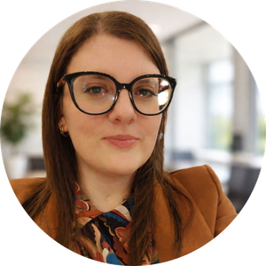

# Dott.ssa Cristina Pellegrini 

*Psicologa clinica con formazione in Psicoterapia Cognitivo Interpersonale e specializzazione nela valutazione e trattamento neuropsicologico dei Disturbi Specifici dell'Apprendimento. Offre percorsi di sostegno psicologico personalizzati per bambini, adolescenti e adulti, con attenzione al benessere della persona nella sua interezza.* 🧠

[Email](x-email:cGVsbGVncmluaWNyaXN0aW5hMTk5MkBnbWFpbC5jb20=) / [MioDottore](https://www.miodottore.it/cristina-pellegrini-4/psicologo/fabriano) / [LinkedIn](https://www.linkedin.com/in/cristina-pellegrini-316082111)

📎 Scarica questo CV [in formato PDF](https://github.com/ferrets6/cvmd-cri/releases/download/latest/cristina-pellegrini-cv.pdf)

## 📍 Studio

**Studio Dott.ssa Pellegrini, Psicologa**
Piazza Garibaldi, 4 — Primo piano
60044 Fabriano (AN)
Tel: 379 3361528

## 🧩 Attività professionale

**Psicologa Clinica** @ [Studio Dott.ssa Pellegrini, Psicologa](https://www.miodottore.it/cristina-pellegrini-4/psicologo/fabriano) *(in corso)*

Esercizio della professione in studio privato a Fabriano (AN), con presa in carico individuale di bambini, adolescenti e adulti.

- Erogazione di colloqui psicologici individuali, percorsi di sostegno psicologico.
- Supporto alla genitorialità e alla coppia
- Consulenza in ambito scolastico.
- Ogni intervento è costruito in modo personalizzato, nel rispetto dei bisogni, delle risorse e dei tempi di ciascuna persona.
- Approccio orientato alla Psicoterapia Cognitivo Interpersonale.

***Aree di intervento:*** ansia, attacchi di panico, depressione, disturbi dell'umore, disturbi di personalità, PTSD, lutto, difficoltà relazionali, dipendenza affettiva, disturbi psicosomatici, DSA, sostegno alla genitorialità.

**Psicologa in libera professione** presso KOS CARE, centro ambulatoriale Santo Stefano di Fabriano (AN)

## 🎓 Formazione

**Specializzazione in Psicoterapia Cognitivo Interpersonale** @ [Scuola ARPCI](https://www.arpci.it) *(in corso)*

Percorso di specializzazione quadriennale in psicoterapia ad orientamento cognitivo interpersonale, presso la scuola ARPCI di Roma.

**Master in Valutazione e Trattamento Neuropsicologico dei DSA** *(conseguito)*

Master specialistico focalizzato sulla valutazione e il trattamento neuropsicologico dei Disturbi Specifici dell'Apprendimento.

**Laurea Magistrale in Psicologia Clinica della Salute e Neuropsicologia** @ [Università degli Studi di Firenze](https://www.unifi.it) *(conseguita)*

**Laurea Triennale in Scienze e Tecniche Psicologiche dei Processi Mentali** @ [Università degli Studi di Perugia](https://www.unipg.it) *(conseguita)*

## 🛠 Competenze

**Ambiti clinici:** psicologia clinica, psicoterapia cognitivo interpersonale, neuropsicologia, valutazione e trattamento DSA

**Tipologia di pazienti:** bambini, adolescenti, adulti

**Prestazioni:** colloquio individuale, sostegno psicologico, sostegno alla genitorialità,sostegno alla coppia

*Autorizzo il trattamento dei dati personali contenuti nel mio curriculum vitae ai sensi dell'art. 13 del D.Lgs. 196/2003 e dell'art. 13 del Regolamento UE n. 679/2016.*
